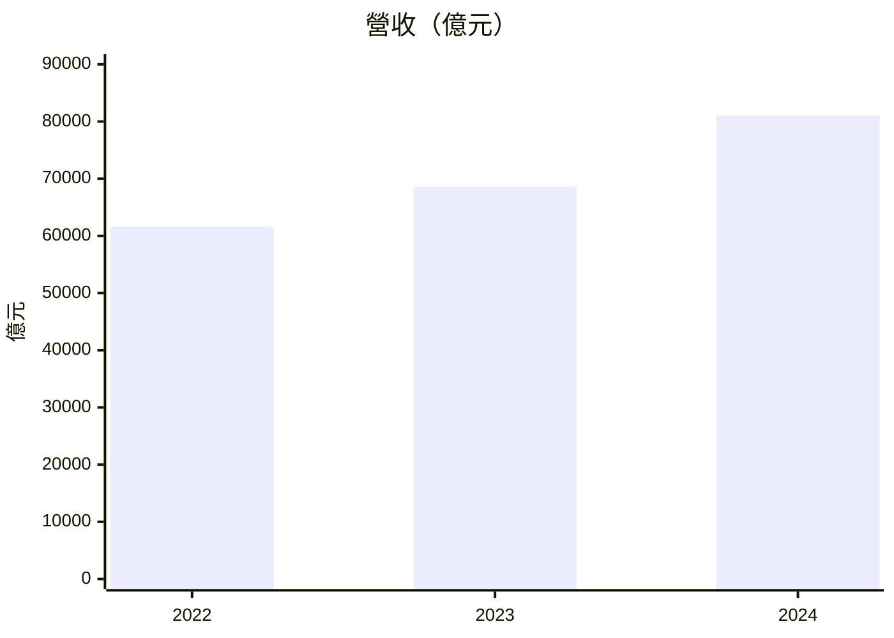
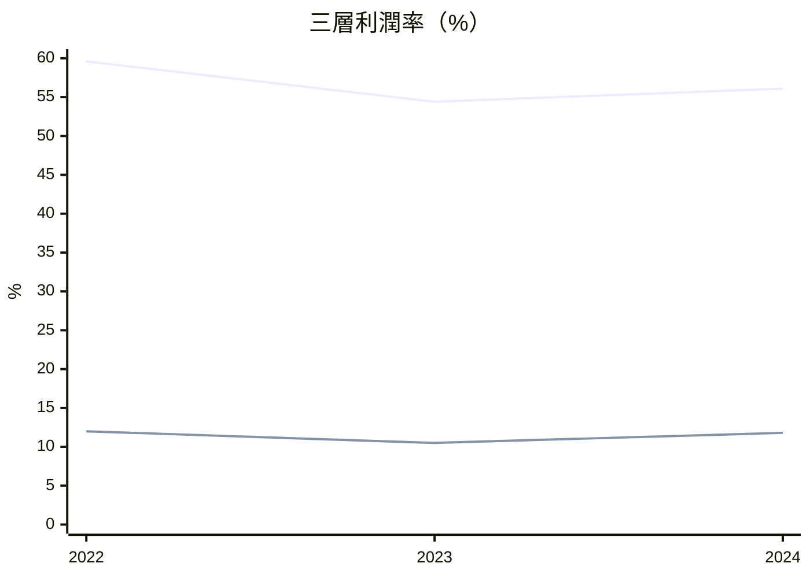
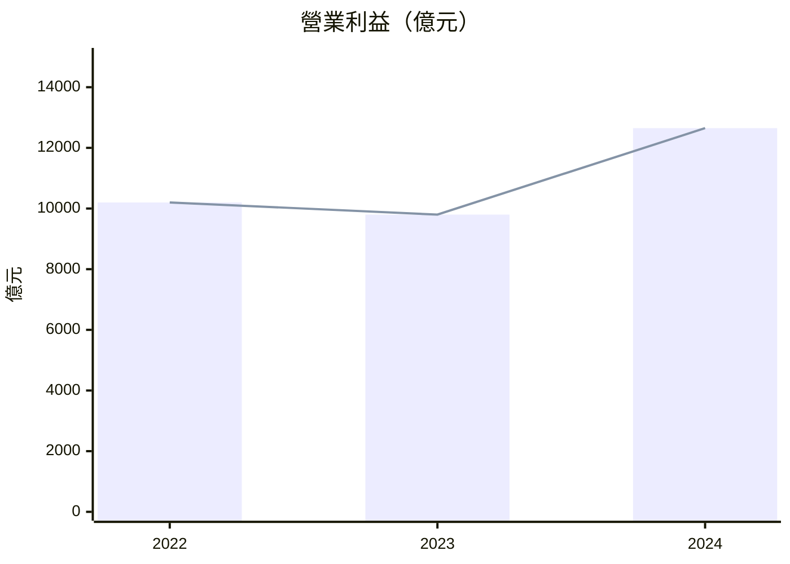

# Markdown 報告模板規格

由 Claude 手寫完整 Markdown，參考本檔的區塊結構與 Mermaid 圖表範例。金額單位一律億元（EPS 為元）。

## 完整報告骨架

```markdown
# {公司名稱}（{股票代碼}）三維財務分析報告

> 資料來源：MOPS 官方財報頁｜分析期間：{起年}–{迄年}｜金額單位：億元（NTD）｜產業類別：{產業}

## 資料來源與驗證

- **抓取時間**：{fetched_at}
- **合理性檢查**：✅ 通過（或 ⚠️ 3 項警示，見下方）
- **MOPS 原始申報**：[上市查詢]({mops_url})｜[上櫃查詢]({mops_url_otc})
- **官方財報頁**：[綜合損益表]({income_url})｜[資產負債表]({balance_url})｜[現金流量表]({cashflow_url})

<!-- 僅當 sanity warnings 不為空才輸出以下區塊 -->
> ⚠️ **合理性警示**
> - `error` **{field}**：{msg}
> - `warn` **{field}**：{msg}

## 📊 一、經營分析

| 指標 | 最新值 | 變化說明 |
|------|-------:|----------|
| 🟢 營收 | 81,031 億 | ▲ +18.1% YoY，AI 伺服器訂單驅動 |
| 🔵 毛利率 | 56.1% | ■ 59.6% → 54.4% → 56.1%，V 型反彈 |
| … 共 5 項 | | |

### 🔍 經營亮點

- 三年營收 61,622 → 68,596 → 81,031 億，CAGR +14.6%，最新年加速 +18.1%…
- （共 4–5 條，每條含起訖數字 + 幅度 + 原因）

（Mermaid 圖表 ×4，見下方範例）

**損益表明細**

| 項目 | 2022 | 2023 | 2024 | 趨勢評估 |
|------|-----:|-----:|-----:|----------|
| 營業收入（億元） | 61,622 | 68,596 | 81,031 | 🟢▲ CAGR +14.6% |
| … | | | | |

## 💰 二、獲利分析
（同上結構：KPI 摘要表 → 🔍 獲利亮點 → Mermaid ×4 → 獲利能力彙總表）

## 🏦 三、財務健全度
（KPI 摘要表 → 🔍 財務健全度亮點 → Mermaid ×4 → 資產負債摘要表 + 現金流量摘要表）
```

## Mermaid 圖表範例

`xychart-beta` 只有單一 Y 軸。金額用 `bar`，比率/趨勢用 `line`。

### 金額長條圖

````markdown

````

### 比率折線圖

````markdown

````

### bar + line 同圖（共用 Y 軸，僅限量級相近）

````markdown

````

**雙軸替代方案**：原本「金額 bar + 比率 line」的雙 Y 軸組合圖在 Mermaid 無法呈現。改為：
1. 金額一張 `bar` 圖、比率一張 `line` 圖；或
2. 只保留金額圖，比率併入 KPI 摘要表與趨勢評估欄。

## 燈號與方向符號對照

| emoji | 方向符號 | 意義 |
|-------|---------|------|
| 🟢 | ▲ | 正向 / 改善 / 成長 / 創高 |
| 🔵 | ■ | 中性 / 橫盤 / 高檔震盪 |
| 🟠 | ▲/■ | 需關注 |
| 🔴 | ▼ | 警示 / 惡化 / 低於警戒 |

## 撰寫注意

- 缺值年度：表格填 `–`，Mermaid 略過該點，勿補 0
- 表格數值欄靠右對齊（`|-----:|`），首欄項目名稱靠左
- Mermaid `title` 含中文時整串用雙引號包住
- 每條亮點須含「起訖數字 + 幅度 + 原因」，禁止「有所成長」「略有下降」這類無數字描述
