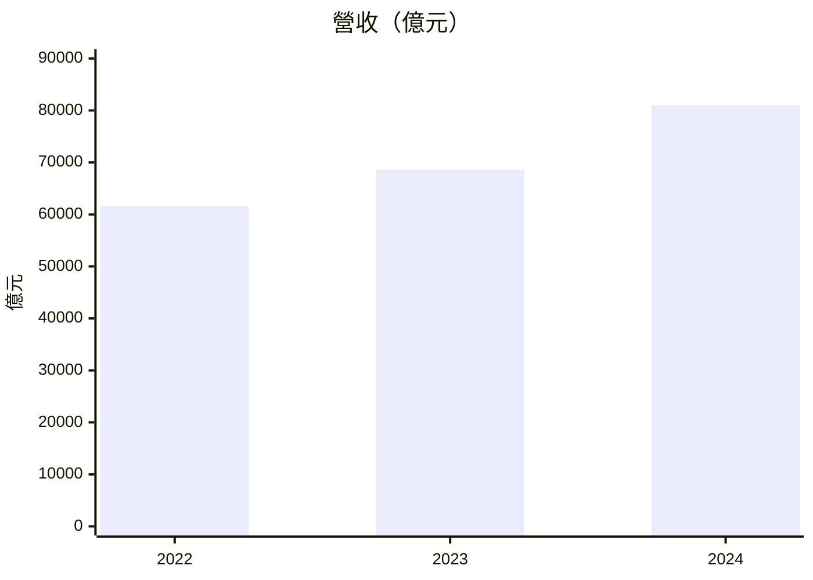

# 台灣股票三維財務分析 Skill

## 概述

本 skill 從 MOPS 官方財報頁抓取台灣上市/上櫃公司的真實年度財報數據，計算三大維度的財務指標，生成一份含 Mermaid 圖表的 Markdown 報告，並**預設寫入「Obsidian 當前開啟的檔案」**（而非另建新檔），也可指定筆記路徑。

**三大分析維度：**
- 📊 **經營分析**：營收成長、毛利率、費用率、管銷研費結構
- 💰 **獲利分析**：淨利、EPS、ROE、ROA、三層利潤率
- 🏦 **財務健全度**：流動比率、負債比率、現金流量、現金部位

---

## 步驟一：抓取財報數據

使用既有入口腳本：

```bash
python3 skills/tw-stock-analysis/scripts/fetch_goodinfo.py 2317
```

這支腳本沿用舊檔名，但目前實際改走 MOPS 官方財報頁，不再依賴 Goodinfo 或 `CLIENT_KEY`。

### 官方來源與端點

- `t164sb03`：合併資產負債表
- `t164sb04`：合併綜合損益表
- `t164sb05`：合併現金流量表

實際抓取時，腳本會對以下 AJAX 端點送 POST：

```text
https://mopsov.twse.com.tw/mops/web/ajax_t164sb03
https://mopsov.twse.com.tw/mops/web/ajax_t164sb04
https://mopsov.twse.com.tw/mops/web/ajax_t164sb05
```

核心參數：

- `co_id=<stock_id>`
- `year=<民國年>`，例如 `113` 代表 `2024`
- `season=04`，代表年度財報
- `TYPEK=sii|otc`
- `isnew=false`

### 解析方式

MOPS 年報頁的實際資料表在回傳 HTML 的第 2 個 table。
每列第 1 欄是會計項目，第 2 欄是當年度金額；綜損表與資產負債表後面還會跟百分比欄，現金流量表則是當年度與前年度金額。

來源單位是 `新台幣仟元`，輸出 JSON 時統一換算成 `億元`；但 `基本每股盈餘` 與 `稀釋每股盈餘` 保留 `元`。

**三張報表的抓取順序：**
1. `t164sb04` → 損益表（營收、毛利、費用、營業利益、淨利、EPS）
2. `t164sb03` → 資產負債表（現金、應收帳款、存貨、流動資產、負債、股東權益）
3. `t164sb05` → 現金流量表（營業CF、投資CF、融資CF、現金股利）

**關鍵欄位對照（損益表）：**

| 中文欄位名 | 用途 |
|-----------|------|
| 營業收入合計 | 年度營收 |
| 營業毛利（毛損） | 毛利金額 |
| 推銷費用 | 推銷費用 |
| 管理費用 | 管理費用 |
| 研究發展費用 | R&D費用 |
| 營業利益（損失） | 營業利益 |
| 稅後淨利 | 稅後淨利（母公司） |
| 每股稅後盈餘(元) | EPS |

**關鍵欄位對照（資產負債表）：**

| 中文欄位名 | 用途 |
|-----------|------|
| 現金及約當現金 | 現金部位 |
| 存貨 | 存貨 |
| 流動資產合計 | 流動資產 |
| 流動負債合計 | 流動負債 |
| 負債總額 | 總負債 |
| 股東權益總額 | 股東權益 |
| 資產總額 | 總資產 |

**關鍵欄位對照（現金流量表）：**

| 中文欄位名 | 用途 |
|-----------|------|
| 營業活動之淨現金流入（出） | 營業CF |
| 投資活動之淨現金流入（出） | 投資CF |
| 融資活動之淨現金流入（出） | 融資CF |
| 固定資產（增加）減少 | 資本支出（負值為增加） |
| 發放現金股利 | 現金股利 |

> 若欄位名稱在不同年度或不同公司略有差異，需以關鍵字模糊比對，例如：`'本期淨利' in k`、`'每股' in k and '盈餘' in k`、`'負債總額' in k or '負債總計' in k`。

---

## 步驟二：計算衍生指標

從原始數據計算以下指標：

```python
# 費用率（各費用 / 營收）
sell_ratio   = sell_exp / revenue * 100
admin_ratio  = admin_exp / revenue * 100
rd_ratio     = rd_exp / revenue * 100
total_opex_ratio = (sell_exp + admin_exp + rd_exp) / revenue * 100

# 毛利率、營業利益率、淨利率
gross_margin = gross_profit / revenue * 100
op_margin    = op_income / revenue * 100
net_margin   = net_income / revenue * 100

# 流動比率、負債比率
current_ratio = current_assets / current_liabilities * 100
debt_ratio    = total_liabilities / total_assets * 100

# ROE、ROA
roe = net_income / equity * 100
roa = net_income / total_assets * 100

# 自由現金流（使用固定資產增減作為 capex 代理）
fcf = operating_cf + capex  # capex 為負值（資產增加）時 FCF = op_cf - |capex|
```

---

## 步驟二點五：三層驗證機制

每次抓取完財報數據後，執行以下三層驗證，結果存入 `result['verification']`。

---

### A. 資料來源標注（Provenance）

在 `result['metadata']` 中記錄完整的數據血緣：

```python
result['metadata'] = {
    'fetched_at': time.strftime('%Y-%m-%dT%H:%M:%S+08:00'),
    'source': 'MOPS 官方財報頁',
    'source_urls': {
        'income_statement': f'https://mopsov.twse.com.tw/mops/web/t164sb04',
        'balance_sheet':    f'https://mopsov.twse.com.tw/mops/web/t164sb03',
        'cash_flow':        f'https://mopsov.twse.com.tw/mops/web/t164sb05',
    },
    'mops_url':     f'https://mops.twse.com.tw/mops/web/t05st01?step=1&co_id={stock_id}&TYPEK=sii',
    'mops_url_otc': f'https://mops.twse.com.tw/mops/web/t05st01?step=1&co_id={stock_id}&TYPEK=otc',
    'years_covered': years[:3],
    'currency': 'TWD 億元',
}
```

---

### B. 合理性檢查（Sanity Check）

計算完衍生指標後，執行以下規則，產生 `result['verification']['sanity']` 列表：

```python
def sanity_check(metrics, years):
    """
    metrics 為 {year: {gross_margin, op_margin, net_margin,
                        current_ratio, debt_ratio, roe, roa}} 的字典
    回傳 warnings 列表，每項為 {'level': 'warn'|'error', 'field': str, 'msg': str}
    """
    warnings = []
    for yr in years:
        m = metrics.get(yr, {})

        gm = m.get('gross_margin')
        if gm is not None:
            if gm > 100:
                warnings.append({'level': 'error', 'field': f'{yr} 毛利率',
                    'msg': f'{gm:.1f}% 超過 100%，數據可能有誤'})
            elif gm < -50:
                warnings.append({'level': 'error', 'field': f'{yr} 毛利率',
                    'msg': f'{gm:.1f}% 低於 -50%，請確認是否為特殊損失年度'})

        cr = m.get('current_ratio')
        if cr is not None and cr < 0:
            warnings.append({'level': 'error', 'field': f'{yr} 流動比率',
                'msg': f'{cr:.1f}% 為負值，請檢查資產負債表數據'})

        dr = m.get('debt_ratio')
        if dr is not None and dr > 100:
            warnings.append({'level': 'warn', 'field': f'{yr} 負債比率',
                'msg': f'{dr:.1f}% 超過 100%，若非金融業則為警示訊號'})

        roe = m.get('roe')
        if roe is not None and roe > 100:
            warnings.append({'level': 'warn', 'field': f'{yr} ROE',
                'msg': f'{roe:.1f}% 超過 100%，可能為高槓桿，請確認股東權益是否偏低'})

    # 相鄰年度淨利率波動檢查
    nm_list = [(yr, metrics[yr].get('net_margin')) for yr in years if yr in metrics]
    for i in range(1, len(nm_list)):
        yr_prev, nm_prev = nm_list[i-1]
        yr_curr, nm_curr = nm_list[i]
        if nm_prev is not None and nm_curr is not None:
            if abs(nm_curr - nm_prev) > 30:
                warnings.append({'level': 'warn',
                    'field': f'{yr_prev}→{yr_curr} 淨利率',
                    'msg': f'波動 {nm_curr - nm_prev:+.1f} 個百分點，建議確認是否有一次性損益'})

    return warnings

result['verification'] = {
    'sanity': sanity_check(metrics_by_year, years[:3]),
    'sanity_pass': all(w['level'] != 'error' for w in warnings)
}
```

---

### C. MOPS 原始申報連結（D）

`result['metadata']['mops_url']`（上市）和 `mops_url_otc`（上櫃）已在步驟 A 記錄，報告的「資料來源與驗證」區塊中以 Markdown 連結呈現，讓使用者可一鍵核對原始申報。

---

## 步驟三：建立 Markdown 報告

**直接由 Claude 手寫完整 Markdown**，不使用 Python 模板生成。參考 `references/dashboard_template.md` 的區塊結構與 Mermaid 圖表規格。

### 報告架構

報告開頭**必須**是 YAML frontmatter（供 Obsidian／Dataview 查詢，並讓 append 模式能去除重複），欄位固定：

```
---
ticker: {股票代碼}
name: {公司名稱}
type: 個股
market: 上市｜上櫃
source: MOPS 官方財報頁
analysis_period: {起始年}-{結束年}
sanity_pass: true｜false
last_updated: {YYYY-MM-DD}
---
```

frontmatter 之後接報告本體：

```
# {公司名稱}（{股票代碼}）三維財務分析報告
> 資料來源標注（來源 | 分析期間 | 金額單位 | 產業類別）

## 資料來源與驗證
- 抓取時間 | 合理性檢查結果（✅ 通過 / ⚠️ N 項警示）
- MOPS 原始申報連結（上市 / 上櫃）| 官方財報頁連結
- 若 sanity warnings 不為空 → 以清單列出每條警示（level + field + msg）

## 📊 一、經營分析
├── KPI 摘要表（5 項）：含具體數字的「變化說明」欄
├── 🔍 經營亮點（3–5 條具體數字觀察）
├── Mermaid 圖表：營收 / 毛利率 / 費用結構 / 營業利益
└── 損益表明細（Markdown 表格，含「趨勢評估」欄）

## 💰 二、獲利分析
├── KPI 摘要表（5 項）
├── 🔍 獲利亮點
├── Mermaid 圖表：淨利 / EPS / 三層利潤率 / 現金股利
└── 獲利能力彙總（含「趨勢評估」欄）

## 🏦 三、財務健全度
├── KPI 摘要表（5 項）
├── 🔍 財務健全度亮點
├── Mermaid 圖表：資產負債結構 / 現金流三表 / 流動+負債比率 / 現金趨勢
└── 資產負債表摘要 + 現金流量摘要（兩張表，均含「趨勢評估」欄）
```

### KPI 摘要表規格

每章開頭以一張 KPI 摘要表呈現 5 項關鍵指標，「變化說明」欄**必須包含具體數字**，不可只寫方向文字。以 emoji 表達燈號（取代原本的卡片色框），方向符號用 `▲`（改善）/`▼`（惡化）/`■`（中性）：

```markdown
| 指標 | 最新值 | 變化說明 |
|------|-------:|----------|
| 🟢 營收 | 81,031 億 | ▲ +18.1% YoY（2024 年 68,596 億），AI 伺服器訂單驅動 |
| 🔵 毛利率 | 56.1% | ■ 2022 年 59.6% → 2023 年 54.4% → 2024 年 V 型反彈至 56.1% |
| 🔴 流動比率 | 146% | ▼ 三年持續下滑 159% → 155% → 146%，首度低於 150% 警戒線 |
```

**燈號 emoji 規則：**
- 🟢 正向指標
- 🔵 中性指標
- 🟠 需關注
- 🔴 警示

### Mermaid 圖表規格

每章 4 張圖以 Mermaid `xychart-beta` 呈現，每張獨立一個程式碼區塊：

````markdown

````

- **金額類**用 `bar`，**比率/趨勢類**用 `line`
- `xychart-beta` **只支援單一 Y 軸**：原本的雙軸組合圖（金額 + 比率）須拆成兩張——一張金額 `bar`、一張比率 `line`；或把比率併入 KPI 表與趨勢評估欄，只保留金額圖
- 同一張圖可同時放 `bar` 與 `line`，但兩者**共用同一 Y 軸**，僅適用於量級相近的數列
- `title` 內若含中文，整串用雙引號包起來；缺值年度直接不畫該點，勿補 0

### 數據表格「趨勢評估」欄規格

**每張數據表格必須包含最後一欄「趨勢評估」**，用簡短文字描述趨勢方向與意義。Markdown 表格無法上色，改以方向 emoji 開頭表達燈號：

```markdown
| 項目 | 2022 | 2023 | 2024 | 趨勢評估 |
|------|-----:|-----:|-----:|----------|
| 稅後淨利（億元） | 8,385 | 11,733 | 12,650 | 🟢▲ 創三年新高 |
| EPS（元） | 32.34 | 45.25 | 48.10 | 🟢▲ 高速成長 +40% |
| 毛利率 | 59.6% | 54.4% | 56.1% | 🔵■ 高檔震盪 |
| 負債比率 | 57.9% | 61.4% | 62.0% | 🔴▼ 突破 60%，需關注 |
```

**趨勢評估文字規則：**
- `🟢▲`：改善 / 成長 / 創高
- `🔴▼`：惡化 / 衰退 / 低於警戒
- `🔵■`：橫盤 / 高檔震盪 / 波動但無明顯方向
- 文字應包含**一個關鍵事實**（數字或判斷），不超過 12 字

---

## 步驟四：亮點段落撰寫規範

每章的亮點段落用 `### 🔍 {章節名}亮點` 作為小標，以無序清單列出 **4–5 條具體數字觀察**。

### 必須符合的格式要求

```
❌ 不合格：「營收有所成長」（無數字、無幅度）
❌ 不合格：「毛利率略有下降」（無具體數值）
✅ 合格：「三年營收 61,622 → 68,596 → 81,031 億，CAGR +14.6%，2025年加速成長 +18.1%，AI伺服器訂單驅動」
✅ 合格：「2023年營業CF為 -982 億（異常），係大量備料AI伺服器存貨所致；2024年存貨消化後強勁回復至 4,456 億，現金轉換能力確認」
```

**每條觀察應包含：**
1. **起點 → 終點數字**（或三年數列）
2. **幅度**（YoY %、CAGR、或絕對變化）
3. **原因推斷或意義**（一句話說明為什麼）

### 各分頁的核心觀察方向

**📊 經營分析亮點：**
- 三年營收趨勢與 CAGR，點名最新年的關鍵驅動因素
- 毛利率是否有結構性改善（品項組合 vs 成本控制）
- 費用率是否隨營收成長而下降（規模效益），研發投入是否維持
- 營業利益率的三年趨勢與費用攤薄效益

**💰 獲利分析亮點：**
- EPS 三年數列 + 最新年 YoY，是否創新高
- 淨利成長是否超過營收成長（利潤率擴張）
- ROE 趨勢，說明改善或惡化原因（淨利 vs 股東權益變化）
- 現金股利三年趨勢，換算配息率或成長幅度

**🏦 財務健全度亮點：**
- 流動比率三年趨勢，是否高於 150%（健康）或 200%（優異）
- 負債比率三年趨勢，是否接近或超過 60%（需關注）
- 現金部位變化，說明增減原因（配息、資本支出、CF 情況）
- 營業 CF 與淨利比較（> 1 為佳），自由現金流是否充裕

---

## 步驟五：輸出（預設寫入 Obsidian 當前開啟的檔案）

報告**預設寫入「Obsidian 當前開啟的檔案」**（而非另建新檔）。固定流程封裝於 `scripts/write_to_obsidian.sh`，**由腳本負責偵測當前檔與寫檔**，代理負責手寫報告內容、（必要時）詢問寫入模式、呼叫腳本、回報結果。

以下 `$SKILL_DIR` 代表本 skill 所在目錄（依實際安裝位置而定）。

```bash
"$SKILL_DIR/scripts/write_to_obsidian.sh" <內容檔> [<筆記路徑>] [<寫入模式>] [<新建檔名>]
```

- `<內容檔>`（必要）：把步驟三／四手寫好的**完整 Markdown 報告**（含步驟三規定的 YAML frontmatter）先存成暫存檔，路徑傳這裡
- `[筆記路徑]`（選擇性）：自訂輸出位置（相對 `VAULT_ROOT`）。**省略＝寫入 Obsidian 當前開啟的檔案**（讀 `.obsidian/workspace.json` 的 active leaf）；偵測不到才建立新筆記
- `[寫入模式]`（選擇性）：`overwrite`（複寫，預設）｜ `append`（附加到檔尾，會去除重複 frontmatter）
- `[新建檔名]`（選擇性）：偵測不到當前檔且未指定路徑時的新筆記檔名，建議傳 `{公司縮寫}_{股票代碼}_analysis.md`
- 環境變數 `VAULT_ROOT`（選擇性）：Vault 根目錄，預設當前目錄 `.`

### 寫入目標與模式（代理務必遵守）

1. 預設目標＝Obsidian 當前開啟的檔案（腳本自 `workspace.json` 偵測 `active` leaf，**不是** `lastOpenFiles[0]`）。
2. **若該檔已有內容，先詢問使用者**：複寫（預設）或附加到檔尾——再依回答傳入 `overwrite`／`append`。
   - 原因：腳本在非互動（被代理呼叫）情境下，遇到非空檔且未指定模式會**預設複寫**並僅印警告，不會停下來問。詢問這一步由代理在呼叫前完成，以免覆蓋既有內容。
3. 使用者若明確指定了某個檔案路徑，就用該路徑（第二參數），略過偵測。

### 回覆使用者

1. 回報報告寫入的位置（當前開啟檔／指定路徑／新建檔）與寫入模式
2. 用 2–3 句話摘要三大維度的核心發現（含具體數字）
3. 附上驗證狀態：
   - 若有合理性警示（`sanity_pass == False`）→ 明確提醒用戶檢查具體欄位
   - 一律附上 MOPS 連結，讓用戶可自行核對原始申報

---

## 注意事項

- MOPS 查詢年度使用民國年，例如 `113` 代表 `2024` 年度財報
- 若某年度數據缺失（顯示為 `-` 或空白），表格填 `–`、Mermaid 圖表直接略過該點，皆不要填入 0
- 金額單位統一為**億元**；MOPS 原始單位為**新台幣仟元**，需自行換算
- 分析期間預設為**最近三年**，但可依用戶需求調整
- 此 skill 僅適用於**台灣上市/上櫃公司**（4位數股票代碼）
- 欄位名稱因公司不同略有差異，抓取時需以關鍵字模糊比對而非完全匹配
